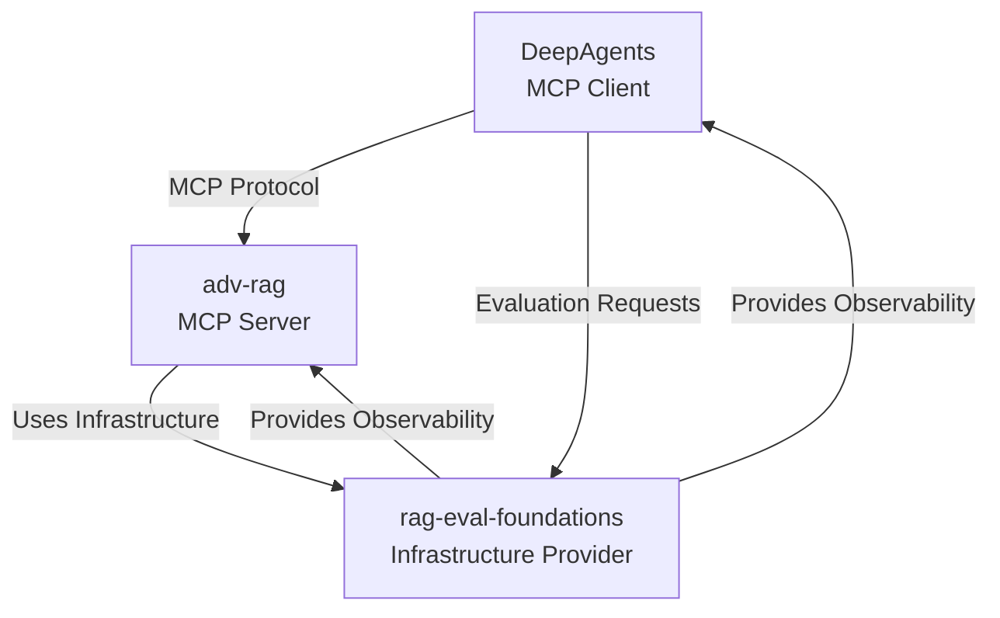

# ADR-005: MCP Integration Triangle Pattern

## Status
✅ **ACCEPTED** - 2025-09-21

## Context

The DeepAgents ecosystem implements a sophisticated integration pattern using the Model Context Protocol (MCP) that forms a triangular relationship between three repositories. Each repository has a distinct MCP role that enables sophisticated AI agent workflows while maintaining clean architectural boundaries.

### MCP Role Analysis

#### DeepAgents: MCP Client
**Role**: Consumer of MCP services for agent augmentation
**Implementation**: `langchain-mcp-adapters` with `MultiServerMCPClient`
**Pattern**: Connects to external MCP servers to expand agent capabilities

#### adv-rag: MCP Server
**Role**: Provider of RAG services via dual MCP interfaces
**Implementation**: FastMCP with CQRS pattern (Tools + Resources)
**Pattern**: Serves both command operations (Tools) and query operations (Resources)

#### rag-eval-foundations: Infrastructure Provider
**Role**: Infrastructure host enabling MCP ecosystem operation
**Implementation**: Docker services, service discovery, unified observability
**Pattern**: Provides the platform for MCP client-server interactions

### Current MCP Implementation Status

**adv-rag MCP Server** (✅ Fully Operational):
- **8 MCP Tools**: Full RAG workflows with LLM synthesis
- **5 MCP Resources**: Fast raw retrieval via CQRS pattern
- **Validation Results**: All endpoints functional, <30s response times
- **Interfaces**: stdio and HTTP transport modes available

**DeepAgents MCP Client** (🟡 Ready for Integration):
- **Framework**: Supports external tool integration via MCP
- **Session Management**: Anti-pattern documentation available
- **Status**: Infrastructure exists, needs adv-rag connection implementation

**rag-eval-foundations Infrastructure** (✅ Operational):
- **Services**: All Docker services running on standard ports
- **Observability**: Phoenix telemetry unified across repositories
- **Service Discovery**: Health checks and connection scripts deployed

## Decision

### **MCP Integration Triangle Architecture**

We will implement a **triangular integration pattern** where each repository has a specific MCP role that enables sophisticated agent workflows:



#### **1. DeepAgents → adv-rag Integration**
**Pattern**: Client-Server via MCP Protocol
**Transport**: stdio (recommended) for local development
**Session Management**: Explicit session lifecycle to avoid connection storms

```python
# Anti-pattern (causes connection storms)
tools = await client.get_tools()  # ❌ NEVER USE

# Correct pattern (explicit session management)
session_ctx = client.session("adv-rag")
session = await session_ctx.__aenter__()
tools = await load_mcp_tools(session)  # ✅ USE THIS
```

#### **2. DeepAgents → rag-eval-foundations Integration**
**Pattern**: Evaluation orchestration
**Implementation**: DeepAgents invokes evaluation workflows
**Data Flow**: Agent results → rag-eval-foundations PostgreSQL

#### **3. adv-rag → rag-eval-foundations Integration**
**Pattern**: Infrastructure dependency
**Implementation**: adv-rag connects to shared services (Qdrant, Redis, Phoenix)
**Service Discovery**: Health checks via infrastructure connection scripts

### **MCP Transport Strategy**

#### **stdio Transport (Primary)**
```bash
# adv-rag MCP server
python src/mcp/server.py  # stdio mode (default)

# DeepAgents client configuration
{
  "command": "python",
  "args": ["src/mcp/server.py"],
  "cwd": "/path/to/adv-rag"
}
```

**Benefits**:
- Lower latency than HTTP transport
- Automatic process lifecycle management
- Built-in security via process isolation

#### **HTTP Transport (Development/Debug)**
```bash
# adv-rag MCP server with HTTP transport
python src/mcp/server.py --transport http --port 8001

# Health check
curl http://localhost:8001/health
```

**Benefits**:
- Easy debugging and inspection
- Compatible with web development tools
- Suitable for distributed deployment

## Implementation Patterns

### **1. CQRS MCP Pattern (adv-rag)**

#### **MCP Tools (Commands)**
```python
# Full RAG pipeline with synthesis
@mcp_tool
async def semantic_retriever(question: str) -> str:
    """Complete RAG workflow with LLM synthesis"""
    context = await retrieve_documents(question)
    answer = await llm.ainvoke(format_prompt(question, context))
    return answer  # Synthesized response ready for agents
```

**Use Cases**:
- DeepAgents research workflows requiring full answers
- Complex queries needing LLM reasoning
- Multi-step RAG operations

#### **MCP Resources (Queries)**
```python
# Fast raw retrieval without synthesis
@mcp_resource("retriever://semantic/{query}")
async def semantic_raw(query: str) -> Dict:
    """Raw document retrieval without LLM processing"""
    documents = await retrieve_documents(query)
    return {"documents": documents, "count": len(documents)}
```

**Use Cases**:
- Performance-critical retrieval (<2s target)
- Bulk document operations
- Custom processing by DeepAgents

### **2. Session Management Pattern (DeepAgents)**

#### **Explicit Session Lifecycle**
```python
from langchain_mcp_adapters.client import MultiServerMCPClient
from langchain_mcp_adapters.tools import load_mcp_tools

class DeepAgentsWithRAG:
    def __init__(self):
        self.mcp_client = MultiServerMCPClient()
        self.rag_session = None
        self.rag_tools = None

    async def setup_rag_integration(self):
        """Establish persistent MCP session"""
        self.rag_session_ctx = self.mcp_client.session("adv-rag")
        self.rag_session = await self.rag_session_ctx.__aenter__()
        self.rag_tools = await load_mcp_tools(self.rag_session)

    async def cleanup(self):
        """Proper session cleanup"""
        if self.rag_session_ctx:
            await self.rag_session_ctx.__aexit__(None, None, None)
```

**Benefits**:
- Prevents connection storm anti-pattern
- Enables connection pooling and reuse
- Proper resource cleanup

### **3. Infrastructure Dependency Pattern (rag-eval-foundations)**

#### **Service Health Monitoring**
```bash
# Cross-repository health checks
./scripts/infrastructure/connect-to-shared-infrastructure.sh

# Expected output for adv-rag
✅ Qdrant (Vector DB) - Available
✅ Redis (Cache) - Available
✅ Phoenix (Observability) - Available
✅ RedisInsight (Cache UI) - Available
```

#### **Unified Observability**
```python
# Phoenix tracing across repositories
import phoenix as px

# rag-eval-foundations hosts Phoenix
px.launch_app(port=6006)

# adv-rag traces to shared Phoenix
tracer = px.Client(endpoint="http://localhost:6006")

# DeepAgents traces to shared Phoenix
phoenix_session = px.Client(endpoint="http://localhost:6006")
```

## Performance Characteristics

### **MCP Tool Performance (Commands)**
- **Target**: <8 seconds end-to-end (including LLM synthesis)
- **Typical**: 3-5 seconds for semantic retrieval with answer generation
- **Bottlenecks**: LLM generation time, complex query processing

### **MCP Resource Performance (Queries)**
- **Target**: <2 seconds raw retrieval
- **Typical**: 200-500ms for vector similarity search
- **Bottlenecks**: Vector database query time, network latency

### **Session Management Performance**
- **Connection Reuse**: Single session serves multiple requests
- **Overhead**: <10ms per request after session establishment
- **Memory**: Persistent sessions reduce allocation overhead

## Integration Constraints

### **1. MCP Protocol Compliance**
- **Tool Definitions**: Must follow MCP schema specifications
- **Resource URIs**: Must use consistent URI patterns
- **Error Handling**: Standardized error responses across tools/resources

### **2. Session Lifecycle Requirements**
- **Explicit Management**: No implicit connection handling
- **Cleanup**: Always cleanup sessions to prevent resource leaks
- **Error Recovery**: Graceful handling of session failures

### **3. Performance Boundaries**
- **Tool Latency**: <8s target for complete workflows
- **Resource Latency**: <2s target for raw data access
- **Concurrent Sessions**: Support multiple simultaneous client connections

### **4. Infrastructure Dependencies**
- **Service Discovery**: All repositories must detect shared infrastructure
- **Health Checks**: Automated validation of service availability
- **Port Standardization**: Consistent port usage across ecosystem

## Monitoring and Observability

### **MCP Integration Metrics**
```python
# Track MCP performance across triangle
metrics = {
    "mcp_tool_latency": "Time for DeepAgents → adv-rag tool calls",
    "mcp_resource_latency": "Time for raw retrieval operations",
    "session_lifecycle": "Connection establishment and cleanup times",
    "error_rates": "Failed MCP calls by type and repository"
}
```

### **Cross-Repository Tracing**
```python
# Phoenix spans across triangle
with tracer.span("deepagents_research_workflow"):
    with tracer.span("mcp_tool_call"):
        result = await rag_tool.ainvoke(query)
    with tracer.span("evaluation_submission"):
        await submit_to_evaluation(result)
```

### **Health Check Framework**
```bash
# Automated triangle health validation
./scripts/validate-mcp-triangle.sh

# Expected output
✅ DeepAgents: MCP client framework ready
✅ adv-rag: MCP server operational (8 tools, 5 resources)
✅ rag-eval-foundations: Infrastructure services healthy
✅ MCP Triangle: End-to-end connectivity verified
```

## Consequences

### ✅ **Positive Outcomes**
- **Scalable Integration**: Standard MCP protocol enables ecosystem growth
- **Performance Optimization**: CQRS pattern optimizes for different use cases
- **Clean Boundaries**: Each repository maintains distinct MCP responsibilities
- **Ecosystem Flexibility**: New repositories can integrate via established patterns

### ⚠️ **Risks and Mitigations**
- **Session Management Complexity**: Risk of connection storms
  - *Mitigation*: Documented anti-patterns and explicit session patterns
- **Protocol Versioning**: MCP changes could break integrations
  - *Mitigation*: Version pinning and backward compatibility testing
- **Performance Dependencies**: Slow services affect entire triangle
  - *Mitigation*: Performance monitoring and circuit breaker patterns

### 📋 **Implementation Roadmap**
1. **Phase 1**: Complete DeepAgents MCP client integration with adv-rag
2. **Phase 2**: Implement evaluation workflow integration via rag-eval-foundations
3. **Phase 3**: Optimize performance and implement monitoring
4. **Phase 4**: Add additional MCP servers to ecosystem as needed

## Examples

### **Complete Triangle Workflow**
```python
async def deepagents_research_with_evaluation():
    # 1. DeepAgents creates agent with MCP tools
    agent = await create_deep_agent_with_rag()

    # 2. Agent uses adv-rag MCP tools for research
    research_result = await agent.ainvoke("Research quantum computing applications")

    # 3. Submit results to rag-eval-foundations for evaluation
    evaluation = await submit_for_ragas_evaluation(research_result)

    # 4. All operations traced in unified Phoenix instance
    return {"result": research_result, "evaluation": evaluation}
```

### **CQRS Usage Patterns**
```python
# High-level research (use MCP Tools)
research_agent = create_deep_agent(tools=mcp_tools)
answer = await research_agent.ainvoke("Explain machine learning")

# Bulk data processing (use MCP Resources)
documents = await mcp_client.read_resource("retriever://semantic/ML concepts")
custom_analysis = process_documents_locally(documents)
```

## References
- [MCP Session Management Guide](./mcp-session-management-guide.md)
- [Repository Separation Pattern](./adr-004-repository-separation-pattern.md)
- [Unified Infrastructure Implementation](./unified-infrastructure-implementation-summary.md)
- [MCP Protocol Specification](https://spec.modelcontextprotocol.io/)
- [FastMCP Documentation](https://github.com/jlowin/fastmcp)

---

**Key Principle**: The MCP Triangle pattern enables sophisticated agent workflows through clear client-server-infrastructure relationships, with each repository maintaining distinct MCP responsibilities and performance characteristics.